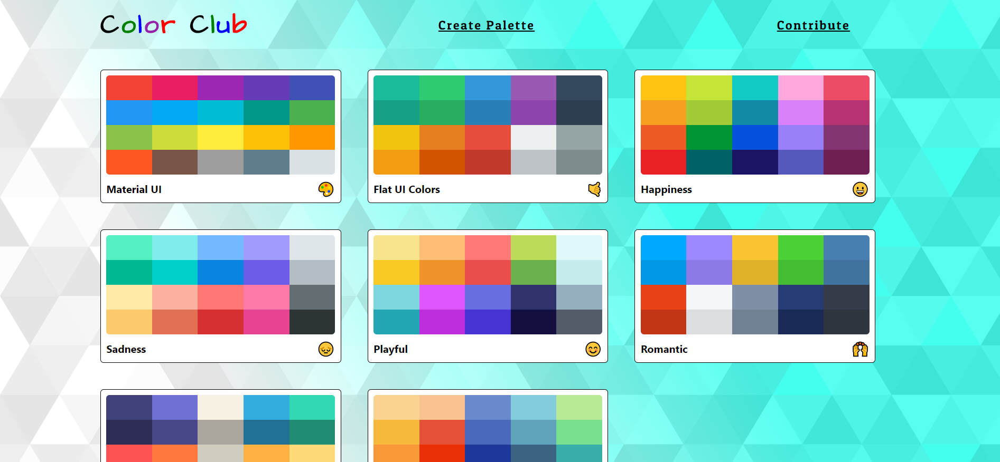
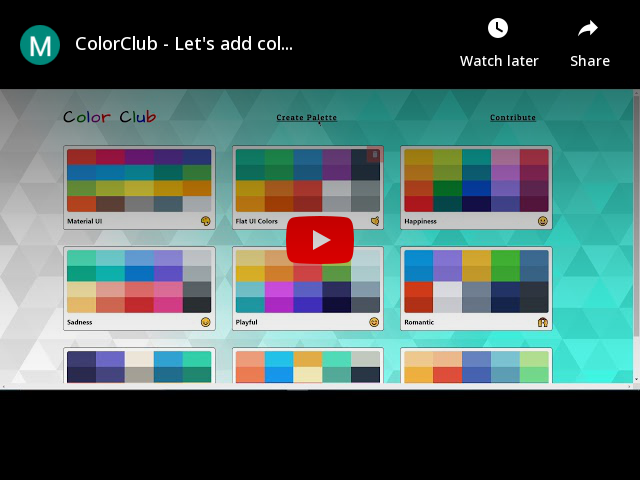

# ColorClub 🎨
### Let's add color and make it beautiful.

## Overview 

- **Create Your Own Pallete**
- **Every Thing Store in Local Storage**
- **Copy RGB/RGBA/HEX Color Codes Directly To Your Clipboard**
- **Every Color Mode (Dark/Light/etc)**
- **Create Your Own Color**

## Video Overview 

## Tech Stack 

- [react] - **Frontend Libraray**
- [material-ui] - **UI Library**
- [react-copy-to-clipboard] - **Tap to copy features**
- [react-router-dom] - **For Client Side Routing**
- [react-sortable-hoc] - **Sortable color box**
- [react-transition-group] - **Route Transistions**
- [chroma-js] - **For all color Handling and randomization**
- [emoji-mart] - **Emoji Picker**
- [rc-slider] - **Sliding In Navbar**

## Run Locally
#### -> Fork This Repo.
#### -> Clone Fork Repo.
#### -> Run Command in terminal cd ColorClub
#### -> npm install
#### -> npm start
#### -> Open [http://localhost:3000](http://localhost:3000) to view it in the browser.

#### Mentor :- Colt Steele

[Colt Steele]:<https://www.youtube.com/channel/UCrqAGUPPMOdo0jfQ6grikZw>
[FLAT UI COLORS 2]:<https://flatuicolors.com/>
[Check it out]:<https://coolors.now.sh/> 
[react]:<https://reactjs.org/>
[material-ui]:<https://material-ui.com/>
[react-copy-to-clipboard]:<https://www.npmjs.com/package/react-copy-to-clipboard>
[react-router-dom]:<https://www.npmjs.com/package/react-router-dom>
[react-sortable-hoc]:<https://www.npmjs.com/package/react-sortable-hoc>
[react-transition-group]:<https://www.npmjs.com/package/react-transition-group>
[chroma-js]:<https://vis4.net/chromajs/>
[emoji-mart]:<https://www.npmjs.com/package/emoji-mart>
[rc-slider]:<https://www.npmjs.com/package/rc-slider>

